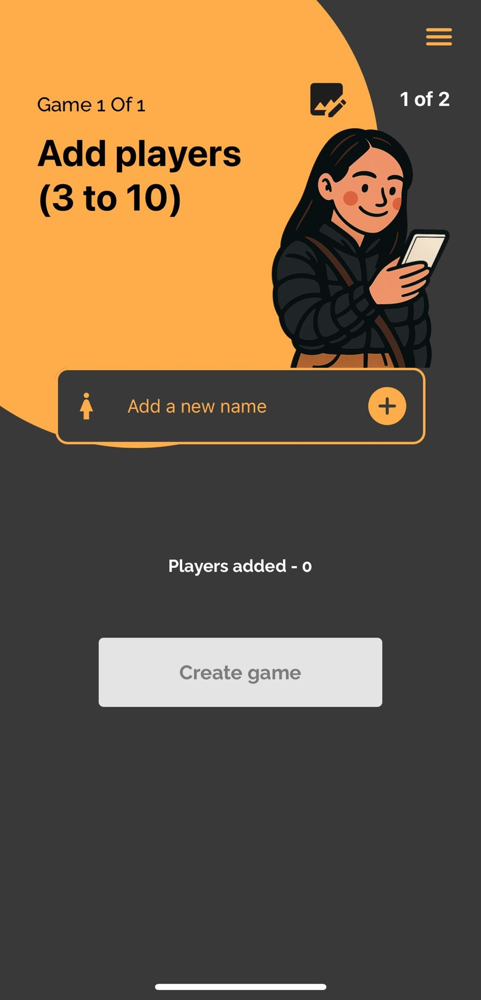
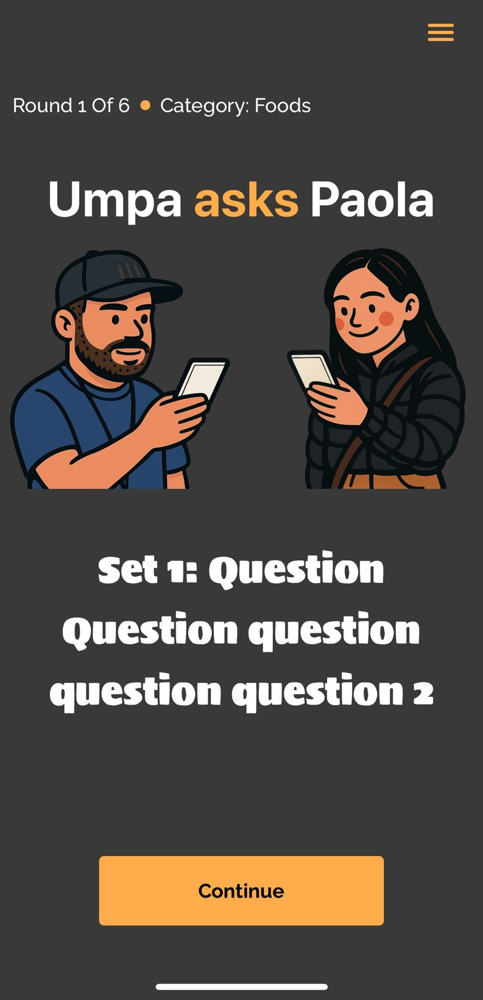
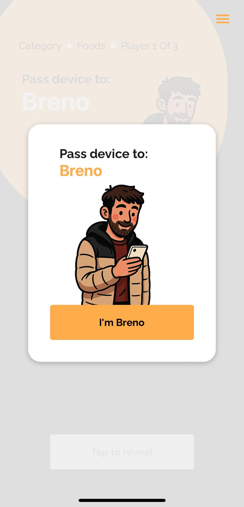

# 🕵️ Who is Lying?

**Who is Lying** is a local multiplayer party game for **3–10 players**, where all the action happens on a single phone. Try to spot the impostor — or _blend in_ and survive if it's you.


---

## 📲 Coming Soon

- **Google Play Store**
- **Apple App Store**

Currently in **final testing**. Stay tuned!

---

## 🧠 How to Play

1. Everyone reads a secret word — except **one player**: the **impostor**.
2. Two rounds of questions follow. Each player answers in turn.
   - The goal: Prove you know the word.
   - But be careful — give too much detail, and the impostor might guess it!
3. After both rounds, everyone votes on who they think the impostor is.
4. The impostor then tries to guess the word to win!

Simple to learn, tricky to master. Perfect for game nights, parties, and social gatherings.

---

## 🚀 Features

- 🎉 3–10 player local play
- 🗝️ Dozens of unique word themes
- 🤫 Secret roles & deception mechanics
- 📱 Easy one-phone interface
- 🧩 Built with React Native + Expo + TypeScript

---

## 🛠 Tech Stack

- **Frontend**: React Native (Expo)
- **Language**: TypeScript
- **State Management**: React Context API
- **Navigation**: React Navigation
- **Testing**: Jira, Jest + React Native Testing Library
- **Code Quality**: ESLint + Prettier

---

## 📋 Project Documentation

This project follows professional software development practices with comprehensive documentation and testing:

- 📖 **[Requirements & Specifications](./requirements.md)** - Detailed functional and non-functional requirements
- 🧪 **[Test Plans & Coverage](./test_plans.md)** - Comprehensive testing strategy with 10+ test cases
- 🏗️ **[Architecture Overview](./docs/ARCHITECTURE.md)** - System design and component structure - TODO
- 🐛 **[Bug Reports & Testing Results](./docs/TESTING_RESULTS.md)** - Manual testing execution results - TODO

---

## 🧪 Quality Assurance

This project demonstrates comprehensive QA practices suitable for production applications:

### Testing Coverage

- ✅ **10+ Test Cases** across functional and edge cases
- ✅ **Unit Testing** with Jest for core game logic - TODO
- ✅ **Integration Testing** for component interactions - TODO
- ✅ **Manual Testing** protocols for user experience validation
- ✅ **Compatibility Testing** across different device sizes

### Testing Types Implemented

- **Functional Testing**: Player management, game flow, win conditions
- **Usability Testing**: Single-device multiplayer UX, accessibility
- **Compatibility Testing**: Multiple screen sizes, Android versions
- **Edge Case Testing**: Interruptions, device rotation, low memory

```bash
# Run unit tests
npm test

# Run tests with coverage
npm run test:coverage

# Run performance tests
npm run test:performance
```

---

## 📸 Screenshots





---

## 💻 Development Setup

### Prerequisites

- Node.js 16+
- npm or yarn
- Expo CLI
- Android Studio (for Android testing)

### Installation

```console
git clone https://github.com/BrenoFischer/whoIsLying
cd whoIsLying
npm install
```

### Running the App

```console
# Start Expo development server
npx expo start

# Run on Android
npx expo start --android

# Run on iOS
npx expo start --ios
```

### Development Commands

```console
# Run tests
npm test

# Run linting
npm run lint

# Format code
npm run format

# Type checking
npm run type-check
```

---

## 🏗️ Architecture & Design Patterns

- **Component Architecture**: Modular React Native components with clear separation of concerns
- **State Management**: Context API for global game state, local state for UI components
- **Navigation**: Stack-based navigation with proper screen transitions
- **Data Flow**: Unidirectional data flow following React best practices
- **Error Handling**: Comprehensive error boundaries and graceful failure handling
- **Performance**: Optimized rendering with React.memo and useMemo where appropriate

---

## 📌 Roadmap

### Completed ✅

- [x] Core game logic implementation
- [x] UI/UX design and responsive layout
- [x] Comprehensive test suite development
- [x] Cross-device compatibility testing
- [x] Technical documentation and requirements

### In Progress 🚧

- [ ] Play Store release preparation
- [ ] Final user acceptance testing
- [ ] Store listing optimization

### Future Enhancements 🔮

- [ ] Multiple language support (i18n)
- [ ] Additional character themes
- [ ] Game statistics and analytics
- [ ] Social sharing features
- [ ] Accessibility improvements

---

## 🔄 Development Process

This project follows professional development practices:

- **Version Control**: Conventional commits with clear commit messages
- **Code Quality**: ESLint + Prettier for consistent code style
- **Testing**: Manual, automatic and regression tests being part of the software life cycle
- **Documentation**: Detailed requirements and technical documentation
- **CI/CD**: Automated testing and code quality checks - TODO
- **Issue Tracking**: Systematic bug reporting on Jira and feature tracking

---

## 🤝 Contributing

Contributions, suggestions, and feedback are welcome!

1. Fork the repository
2. Create a feature branch (`git checkout -b feature/AmazingFeature`)
3. Commit changes (`git commit -m 'Add: Amazing new feature'`)
4. Push to branch (`git push origin feature/AmazingFeature`)
5. Open a Pull Request

Please ensure all tests pass and follow the established code style.

---

## 📄 License

This project is licensed under the [MIT License](https://opensource.org/license/mit).

---

## 👤 Author

**Breno Fischer**  
GitHub: [@BrenoFischer](https://github.com/BrenoFischer)
