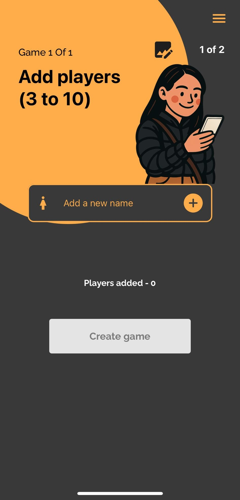
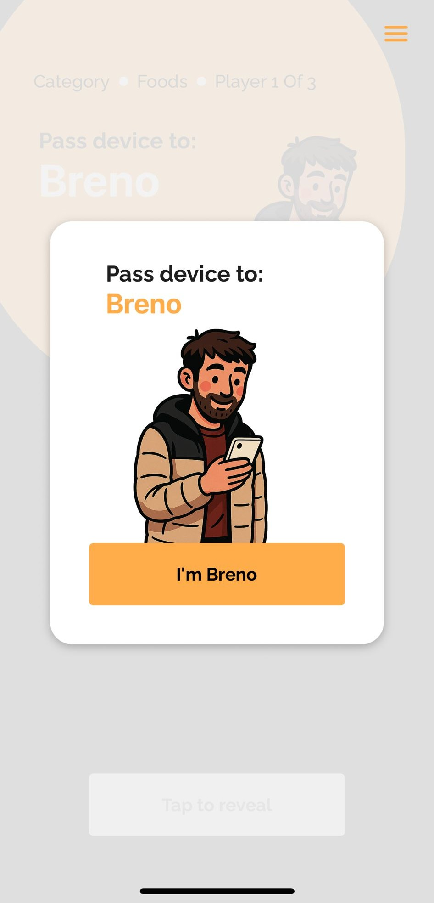

# Who is Lying?

**Who is Lying** is a local multiplayer social deduction party game for 3–10 players on a single device. Everyone knows the secret word — except the impostor. Ask the right questions, give convincing answers, and identify the spy before they guess the word and win.

Available on Android. iOS version in preparation.

---

## Screenshots

  

---

## How to Play

1. Select a **word category** (Food, Animals, Halloween, and more).
2. Configure game settings: number of impostors, sets of questions, and whether to randomize impostors.
3. Each player receives the secret word privately — the impostor(s) see nothing.
4. Players take turns **asking and answering questions** in structured rounds. Answers may be recorded as audio.
5. After all rounds, a **discussion phase** lets everyone review questions and listen back to recordings.
6. Each player **votes** on who they believe the impostor(s) are.
7. The impostor(s) make a final attempt to **guess the secret word**.
8. Scores are calculated and an **animated end-game ranking** is revealed.
9. Play again with the same group — scores carry over across matches.

---

## Features

- Local play for 3–10 players on a single device
- Configurable number of impostors (1–3), including a random/hidden mode
- Configurable sets of questions (1–3 sets per game)
- Audio recording per round — playback during discussion
- Exposure-based question distribution (low / medium / high difficulty) that escalates across sets
- Turn-based voting with multi-select when there are multiple impostors
- Detailed score breakdown per match with animated end-game screen
- Persistent game state via AsyncStorage — the app resumes where it left off after backgrounding
- **Saved players** — profiles are created automatically on game start and reused across sessions (up to 30 players)
- **Player stats** — per-player lifetime stats: matches played, wins, impostor detection rate, vote accuracy, lifetime score
- **Match history** — rolling log of the last 20 matches with per-player results and scores
- **Quick-add from saved players** — tap any saved profile on the create-game screen to add them instantly
- Bilingual: English and Brazilian Portuguese
- Unique character selection with theme filters
- Game configuration conflict resolution (too many impostors for player count)

---

## Tech Stack

| Layer | Technology |
|---|---|
| Framework | React Native (Expo SDK 54) |
| Language | TypeScript |
| Routing | Expo Router (file-based) |
| State Management | React Context API + AsyncStorage |
| Animations | React Native Reanimated |
| Responsive Layout | react-native-size-matters |
| Audio | expo-audio |
| Internationalisation | Custom i18n with JSON translation files |
| Testing | Jest 29 + React Native Testing Library |
| Code Quality | ESLint + Prettier |
| Build & Distribution | EAS Build (Expo Application Services) |

---

## Project Structure

```
whoIsLying/
├── app/                    # Expo Router screens (file-based routing)
│   ├── index.tsx           # Home / splash screen
│   ├── selectCategory.tsx  # Category carousel with flip-card preview
│   ├── createGame.tsx      # Player setup and game configuration
│   ├── showWordToAll.tsx   # Private word reveal per player
│   ├── words.tsx           # Impostor's private "you are the impostor" screen
│   ├── round.tsx           # Active question round with audio recording
│   ├── discussion.tsx      # Review all questions and audio playback
│   ├── votes.tsx           # Voting screen (multi-select for multi-impostor)
│   ├── votesResults.tsx    # Vote tally before impostor reveal
│   ├── revealImpostor.tsx  # Reveal impostor identity
│   ├── revealWord.tsx      # Impostor's word guess screen
│   ├── endGame.tsx         # Animated per-match score rankings
│   └── endOfMatches.tsx    # Final tournament standings
├── context/
│   ├── GameContext.tsx      # Central game state and all game logic
│   ├── HistoryContext.tsx   # Saved players, player stats, and match history
│   ├── LanguageContext.tsx  # Language selection (EN / PT)
│   └── AppResetContext.tsx  # Full app state reset
├── components/
│   ├── savedPlayersList/    # Quick-add modal — lists saved profiles on create-game screen
│   ├── playerStats/         # Player stats screen (accessible from sidebar)
│   ├── matchHistory/        # Match history screen (accessible from sidebar)
│   └── ...                  # Other reusable UI components
├── types/
│   ├── SavedPlayer.ts       # SavedPlayer and SavedPlayerStats interfaces
│   ├── MatchRecord.ts       # MatchRecord and MatchRecordPlayer interfaces
│   └── ...                  # Game, Player, Round, Vote, GameConfig
├── data/
│   └── categories.json      # Word lists and question pools per category
├── translations/            # i18n JSON files (en.json, pt.json, categories.en.json, categories.pt.json)
├── styles/                  # Design tokens (colors, fontSize, spacing, radius)
├── utils/
│   └── gameTranslations.ts  # Word index resolution utilities
└── __tests__/
    ├── GameContext.test.tsx  # 56 automated unit tests for core game logic
    └── HistoryContext.test.tsx # 24 automated unit tests for history and saved players
```

---

## Architecture

### State Management

Game state is split across two contexts:

**`GameContext`** is the single source of truth for the active match — players, rounds, voting, configuration, scores, and navigation history. It persists to `AsyncStorage` after every change so the app can resume from the exact screen if backgrounded or closed. On mount it merges saved state with `INITIAL_GAME` defaults, ensuring new config fields always have valid values when upgrading from an older saved state.

**`HistoryContext`** manages everything that persists across multiple sessions: saved player profiles (up to 30), per-player lifetime stats, and the rolling 20-match history. It hydrates from `AsyncStorage` on mount and writes back whenever its state changes. The two contexts are independent — `HistoryContext` writes to `endGame.tsx` after scoring is complete, and `createGame.tsx` reads from it to offer the quick-add and auto-save features.

### Game Configuration

`GameConfig` controls three dimensions independently:

- **numberOfImpostors** (1–3): how many players receive the impostor role.
- **setsOfQuestions** (1–3): how many question rounds each player answers. Total rounds = `players × sets`.
- **randomImpostors**: if true, the number of impostors is randomised each game and hidden from players.

A conflict-resolution modal automatically appears if the configured impostor count exceeds the player count constraint (`maxImpostors = players − 2`).

### Question Distribution

Questions are classified as `low`, `medium`, or `high` exposure (how likely they are to reveal the impostor). The engine distributes questions across exposure levels per set using a fixed schedule that escalates pressure:

| Sets | Set 1 | Set 2 | Set 3 |
|---|---|---|---|
| 1 set | 50% L · 30% M · 20% H | — | — |
| 2 sets | 70% L · 30% M · 0% H | 10% L · 40% M · 50% H | — |
| 3 sets | 100% L · 0% M · 0% H | 30% L · 50% M · 20% H | 0% L · 30% M · 70% H |

Counts use largest-remainder rounding so they always sum to exactly `players`.

### Scoring

Scores are resolved in a single pass at the end of voting by `resolveScoreOfTheMatch`:

**Civilians:**
- +2 pts for detecting 1 impostor
- +3 pts for detecting 2 impostors in the same vote
- +5 pts for detecting all 3 impostors in the same vote

**Impostors:**
- +1 pt per voter who fails to identify them (accumulates during voting pass)
- Flat bonus if **never** detected: +3 (1 impostor), +5 (2 impostors), +10 (3 impostors) — replaces the per-voter +1 pts
- +3 pts if they correctly guess the secret word

Match scores are stored separately in `player.matchScore` so the end-game animation can display a per-event breakdown before merging into the cumulative `player.score`.

### Routing & Screen Persistence

Expo Router provides file-based navigation. The current screen path is written to `game.currentScreen` via `setCurrentScreen` on every screen mount. On app launch, if a saved game exists with players, the app navigates directly to `currentScreen` instead of the home screen.

---

## Development Setup

### Prerequisites

- Node.js 18+
- npm
- Expo CLI (`npm install -g expo-cli`)
- Android Studio (for Android emulator) or a physical device with Expo Go

### Installation

```bash
git clone https://github.com/BrenoFischer/whoIsLying
cd whoIsLying
npm install
```

### Running the App

```bash
# Start Expo development server
npx expo start

# Run on Android emulator
npx expo start --android

# Run on iOS simulator
npx expo start --ios
```

### Development Commands

```bash
# Run all tests
npm test

# Run tests in watch mode
npm run test:watch

# Run tests with coverage report
npm run test:coverage

# Lint the codebase
npm run lint

# Format code with Prettier
npm run format
```

---

## Quality Assurance

The project follows a structured, multi-layer QA strategy. Each layer targets a different class of defect and runs at a different point in the development cycle.

---

### 1. Unit Tests

**Tool:** Jest 29 + React Native Testing Library
**When:** On every change, before every commit

The entire business logic layer is covered by 80 unit tests across two context files. Tests run in-memory with all external dependencies mocked (AsyncStorage, file system, UUID), so the full suite completes in under 5 seconds. The philosophy is to test **behaviour, not implementation** — tests assert on the public contract each context exposes, not on internal data structures.

```
Test Suites: 2 passed
Tests:       80 passed, 80 total
Pass rate:   100%
```

**GameContext** — `__tests__/GameContext.test.tsx` (56 tests)

| Suite | Tests | What is covered |
|---|---|---|
| Initial State | 2 | Default game shape, AsyncStorage hydration |
| Game Configuration | 5 | `setNumberOfImpostors`, `setSetsOfQuestions`, `setRandomImpostors` |
| Word Management | 6 | `getRandomWord`, `setGameWord`, `getCurrentWord` |
| Round Navigation | 3 | `nextRound`, `previousRound`, `showWordToNextPlayer` |
| Player Management | 3 | `updatePlayers`, `getSortedPlayers` (score + tie-break) |
| createGame | 7 | Round count, impostor selection, edge cases |
| Impostor Identification | 3 | `checkIfPlayerIsLiar`, `getLyingPlayers` |
| Voting | 4 | `addVote` (single + multi), `setImpostorVotes` |
| Round Questions | 3 | `getCurrentQuestion` |
| Audio Recordings | 4 | `saveRecordingToRound`, `getRoundAudio` |
| Screen Tracking | 2 | `setCurrentScreen` |
| resolveScoreOfTheMatch | 7 | All scoring branches (detect, miss, never-detected, word guess, cumulative) |
| Game Reset Functions | 5 | `createNewGame`, `resetGameWithExistingPlayers`, `previousRankings` |
| Context Provider Contract | 2 | Public API surface, state and hydration flag |

**HistoryContext** — `__tests__/HistoryContext.test.tsx` (24 tests)

| Suite | Tests | What is covered |
|---|---|---|
| Hydration | 3 | `isHydrated` lifecycle, loading from AsyncStorage, empty storage |
| Persistence | 3 | Writes on state change, no write before hydration |
| getSavedPlayerByName | 2 | Found / not found |
| deleteSavedPlayer | 2 | Removes correct player, no-op for missing id |
| getAutoDeleteCandidates | 4 | Room check, exact count needed, fewest-matches ordering, createdAt tie-breaking |
| commitAutoSave | 4 | Creates with INITIAL_STATS, deletes before adding, keeps non-deleted, empty no-op |
| updateSavedPlayerStats | 3 | Merges correctly, isolation from other players, no-op for missing id |
| recordMatch | 3 | Prepend order, 20-entry cap (oldest dropped), sequential records |

A minimum coverage threshold of 70% across branches, functions, lines, and statements is enforced via Jest configuration.

See [jest_tests.md](./jest_tests.md) for the full suite documentation with rationale per test group.

---

### 2. Regression Tests

**Tool:** Same Jest suite (`npm test`)
**When:** Before every production build

The unit test suite doubles as the regression baseline. Before any release build, `npm test` is run in full. All 80 tests must pass — a single failure blocks the build. This ensures that new features or bug fixes have not silently broken existing behaviour in game logic, scoring, persistence, or history tracking.

Because the tests run in under 5 seconds, this gate adds no meaningful friction to the release process.

---

### 3. Manual Functional Tests

**When:** Before every production build, after the automated suite passes

99 structured test cases across 12 test plans cover the full user journey that automated tests cannot reach: real UI interactions, screen navigation, animations, audio playback, and device-specific behaviour.

| Test Plan | Cases | Focus |
|---|---|---|
| 1 — Player Management | 9 | Adding, editing, deleting players; character and name constraints |
| 2 — Game Configuration | 12 | Impostor count, question sets, random mode, conflict resolution |
| 3 — Word & Category | 5 | Category selection, locked categories, state passing |
| 4 — Word Reveal | 5 | Civilian vs impostor reveal, device-pass flow |
| 5 — Question Rounds | 7 | Round count, question display, audio recording |
| 6 — Discussion Phase | 5 | Audio playback, switching recordings |
| 7 — Voting | 8 | Single and multi-impostor voting, self-vote prevention |
| 8 — Vote Results & Reveal | 7 | Tally accuracy, impostor reveal, word guess |
| 9 — Scoring & End Game | 8 | All scoring branches, rank change indicators |
| 10 — Persistence & Resume | 3 | Backgrounding and session recovery |
| 11 — Internationalisation | 4 | EN/PT switching, persistence across screens |
| 12 — History & Saved Players | 26 | Auto-save, quick-add, auto-delete conflict, stats accuracy, match history |

Test cases are tracked in [test_plans.md](./test_plans.md) with status, notes, and bug IDs. Test execution and results are managed in **[Qase](https://qase.io)**, a dedicated test case management tool. New test cases are synced to Qase via a local diff script (`scripts/export-tests.js`) that tracks which cases have already been imported and only exports new ones as a JSON file ready for Qase's importer.

**Release criteria:**

| Gate | Threshold |
|---|---|
| All Critical manual test cases | 100% pass |
| All High priority manual test cases | 95% pass |
| All 80 automated unit tests | 100% pass |
| No crashes on Android 7.0+ | — |

---

### 4. End-to-End Tests *(planned)*

**Tool:** Detox
**When:** Future — planned before public store release

End-to-end tests will simulate real user journeys on a physical emulator — tapping, typing, navigating — and assert on what appears on screen. Unlike unit tests, they catch bugs that only appear when the full app stack runs together: navigation regressions, layout issues, and real-device AsyncStorage behaviour. Detox integration is listed in the roadmap as a pre-public-launch target.

---

## Project Documentation

| Document | Description |
|---|---|
| [requirements.md](./requirements.md) | Functional and non-functional requirements with data models and game flow |
| [test_plans.md](./test_plans.md) | Manual test cases, QA strategy, and release criteria |
| [jest_tests.md](./jest_tests.md) | Automated test suite documentation with results |

---

## Roadmap

### Completed

- [x] Core game logic with multi-impostor support
- [x] Configurable game settings (impostors, question sets, random mode)
- [x] Audio recording and playback per round
- [x] Exposure-based question escalation system
- [x] Animated end-game score screen (React Native Reanimated)
- [x] Game state persistence and session resume
- [x] Bilingual support (English / Brazilian Portuguese)
- [x] Saved player profiles with automatic creation and quick-add on game start
- [x] Per-player lifetime stats (matches, wins, impostor detection, vote accuracy, score)
- [x] Rolling 20-match history accessible from the sidebar
- [x] 80 automated unit tests — 100% pass rate
- [x] Google Play Store (Android) release (currently closed tests)

### In Progress

- [ ] Apple App Store (iOS) submission
- [ ] Additional word categories
- [ ] Additional Characters

### Future Enhancements

- [ ] Store purchase of themes/characters
- [ ] Spanish language support
- [ ] End-to-end tests with Detox
- [ ] Accessibility improvements (screen reader support)

---

## Author

**Breno Fischer**
GitHub: [@BrenoFischer](https://github.com/BrenoFischer)

---

## License

This project is licensed under the [MIT License](https://opensource.org/license/mit).
